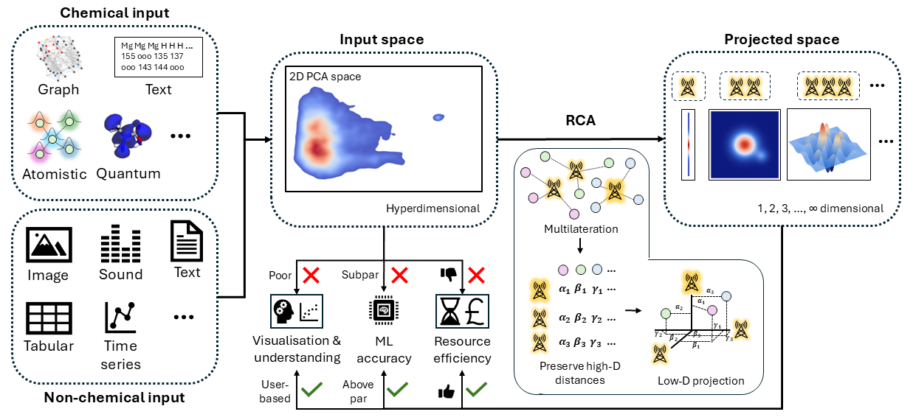
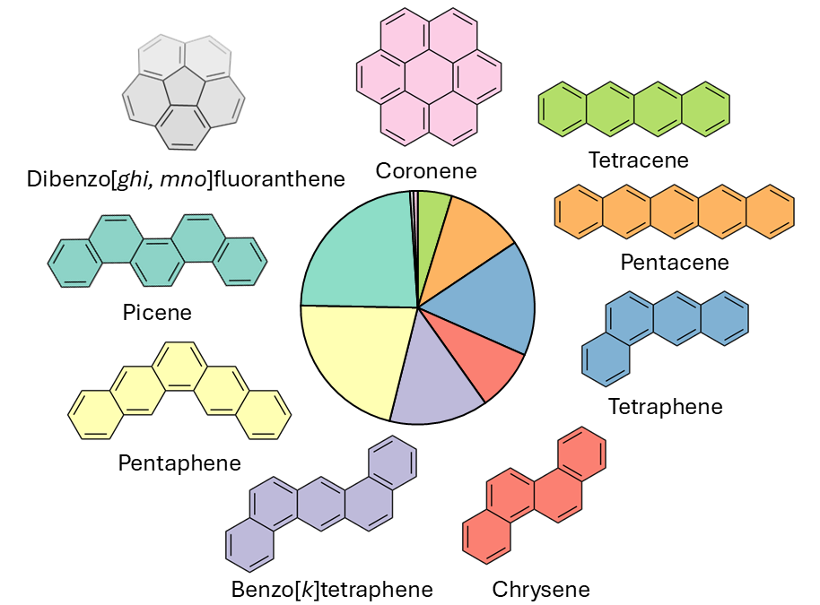

# Navigating the chemical space with a molecular GPS
<p align="center">
  
</p>

## Welcome! 👋
This repository accompanies the research paper of the same name and provides an implementation of Reference-based Coordinate Assignment (RCA) — a method for projecting high-dimensional data into a space of different dimensionality.

RCA treats points in the original high-dimensional space as belonging to two groups:

* X: a set of data points defined by the user (e.g., from a dataset)

* Y: a set of reference points that aren't part of the original dataset

The core idea of RCA is to project the X space into a new coordinate system while preserving only the pairwise distances between Y–Y and X–Y points. This approach is inspired by the concept of multilateration. As an analogy, you can think of the Y points (called reference points) as cell towers or satellites, and the X points as unknown locations. RCA aims to determine the positions of the X points using only their distances to the Y reference points.

## ❓ Why This Project?
In the introduction of the article, we review several existing techniques for dimensionality reduction. However, RCA is best understood not as a traditional dimensionality-reduction method, but as a projection technique: it projects the original input space into a new space whose dimensionality equals the number of reference points.

The motivation behind developing RCA is twofold. First, it provides an intuitive framework that can be directly compared to GPS and multilateration-based tracking systems—except now applied in high-dimensional spaces. Second, RCA offers a quantitative way to express the “similar structure → similar property” principle. Across multiple datasets, machine-learning tasks, and model architectures, we show that using RCA-projected spaces as input not only reduces computational cost and runtime, but also consistently improves predictive accuracy.

## 🔧 Installation

To generate the RCA space from the input space, install the package using:

```bash
pip install RCA-space
```
The core function for generating the RCA space, `RCA_vectorised`, depends only on [NumPy](https://numpy.org/). However, to generate the required inputs for this function, you may use `RCA_reference_projection`, which introduces additional dependencies on both [NumPy](https://numpy.org/) and [scikit-learn](https://scikit-learn.org/stable/).

## 🚀 How to Use

To generate the RCA space from a given input, two functions are required. The `RCA_reference_projection` function produces the necessary inputs for constructing the RCA space. This function has the following syntax:

`arr1,arr2=RCA_reference_projection(original_array, ref_array=None, k=None)`

This function takes as input the coordinates of the high-dimensional input space (`original_array`) and, optionally, the coordinates of a set of reference points (`ref_array`). If no predefined reference constellation is provided, the user may instead specify a value of `k`, in which case the function will compute the cluster centroids of the input space and use them as the reference constellation.

This function outputs two arrays: the reduced coordinates of the reference points (`arr1`), and the pairwise distances between the high-dimensional reference points and the unknown points (`arr2`).

Once this function has been executed, the next step is to run `RCA_vectorised`. This function has the following syntax:

`RCA_space=RCA_vectorized(ref_point, distances)`

Here, `ref_point` refers to the low-dimensional coordinates of the reference constellation (corresponding to `arr1` in the function above), and `distances` refers to the distance matrix between the reference points and the unknown points (corresponding to `arr2` in the function above).

A short tutorial on how to use the code is included in this repository.

## 🎓 Tutorial

In the Tutorial folder of the repository, you can find an example showing how to generate the RCA space from images and perform machine learning regression using that representation.

## N-HPC-1X dataset
The N-HPC-1X dataset was created by applying the GANNA algorithm to introduce between one and six nitrogen atoms into frameworks composed of four to eight conjugated rings. It contains 10,582 nitrogen-doped compounds, all in their neutral closed-shell state. For each structure, the geometry, single-point energy, and HOMO/LUMO energies were computed at the PBE0-D3/def2-TZVP level of theory. The dataset includes the following types of frameworks:

<p align="center">
  
</p>

## Contact
If you have questions, feel free to reach out: stivllenga@gmail.com

## Citation
If you use this project in your research, please cite:
URL URL URL
